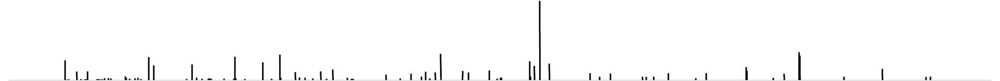

---
hide:
  - toc
---

<h1 style="text-align: center; margin: 0px; font-size: 3em; color: black;">Proteomics Academy</h1>

your educational resource for proteomics

 

Proteomics Academy is an educational resource for scientists wanting to exchange on Proteomics. It is a joint effort of the [European Proteomics Association (EuPA)][eupa] educational committee and the [European Bioinformatics Community for Mass Spectrometry (EuBIC-MS)][eubic] to foster exchange of knowledge on proteomics.

The website and its different components are under constant improvement. Feel free to explore, share your ideas, and contact us if you want to contribute!

 

-   :material-book-open:{ .lg } __Online education__

    ---

    Learn from home with free online tutorials, lectures, and courses

    [:octicons-arrow-right-24: Start learning](online-education.md)

-   :material-tooltip-question:{ .lg } __Q&A__

    ---

    Any unanswered questions? Get connected with the community and ask your
    questions on our recommended platforms.

    [:octicons-arrow-right-24: Ask your questions and find answers](q-and-a.md)

-   :material-calendar-month:{ .lg } __Events__

    ---

    Stay up to date with the latest proteomics events. We list conferences,
    workshops, and webinars that are relevant to the proteomics community.

    [:octicons-arrow-right-24: Find upcoming events](events/index.md)

-   :material-office-building:{ .lg } __Jobs__

    ---

    Looking for a job in proteomics? Check out [JobRxiv][jobrxiv] with the `EuPA`
    keyword for proteomics-related jobs.

    [:octicons-arrow-right-24: Find and post open positions](jobs.md)

 

[eupa]: https://www.eupa.org/
[eubic]: https://eubic-ms.org/
[jobrxiv]: https://jobrxiv.org/?search_keywords=eupa
